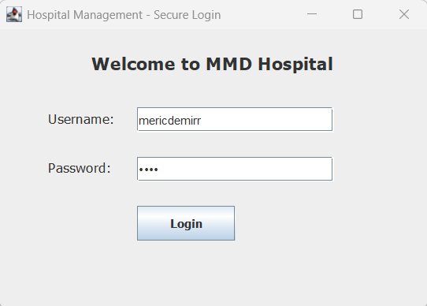
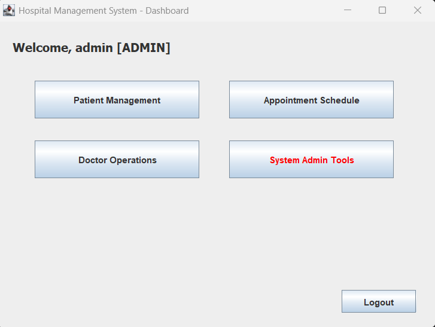
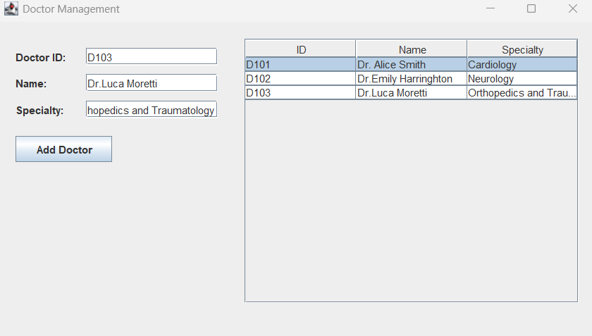
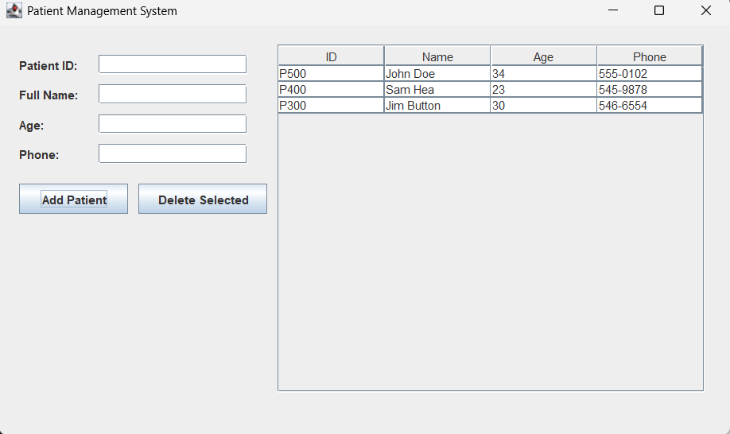
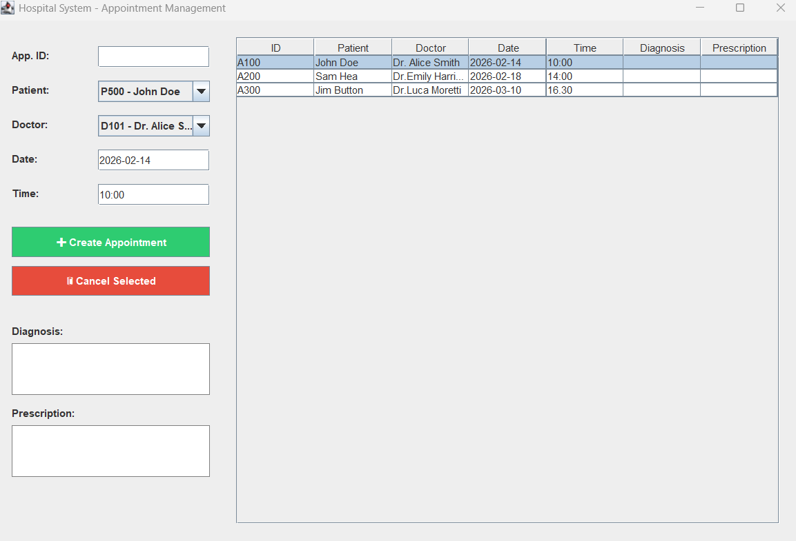
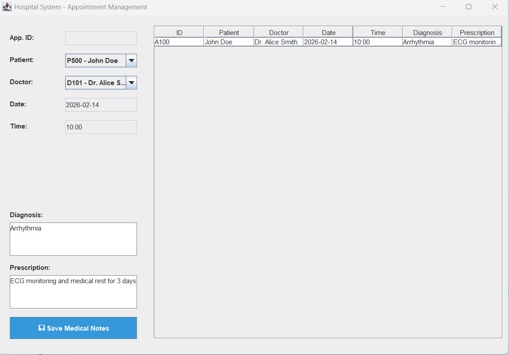
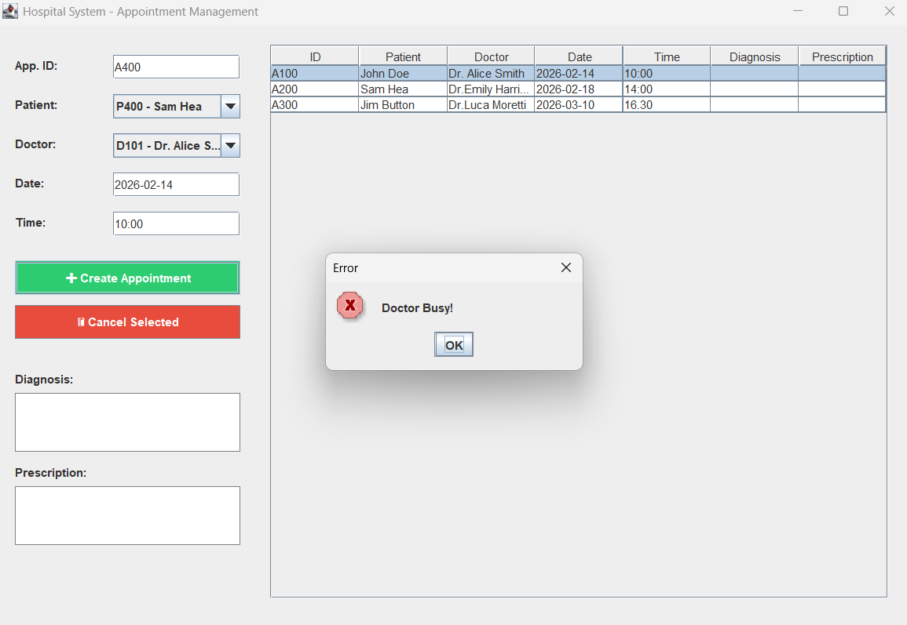

# 🏥 Hospital Management System (HMS)

This is a user-friendly desktop application for managing hospital operations. It allows users to manage doctors, patients, and appointments easily. The system is built with **Java Swing** and uses **SQLite** for data storage.

---

## ✨ Key Features

* **Role-Based Login:** Secure access for Admins, Doctors, and Secretaries.
* **Management Tools:** Add or delete doctor and patient records.
* **Smart Scheduling:** Create and manage patient appointments.
* **Medical Records:** Doctors can add diagnoses and prescriptions.
* **Conflict Detection:** The system automatically checks if a doctor is busy at a chosen time.

---

## 📸 System Preview

### 1. Secure Login
The entry point of the system.

### 2. Admin Dashboard
The main control panel for hospital staff.

### 3. Patient & Doctor Management
Database management for hospital personnel and patients.

### 4. Appointment & Medical Notes
Managing schedules and patient health details.

### 5. Smart Error Handling
Prevents double-booking for the same doctor.

---

## 🛠️ Technology Stack

* **Language:** Java (JDK 22)
* **GUI:** Java Swing
* **Database:** SQLite
* **Architecture:** DAO (Data Access Object) Pattern

---

## 🚀 How to Run

1.  Clone the repository.
2.  Add the `sqlite-jdbc` library to your project's classpath.
3.  Run the **`HospitalSystem.java`** file.
4.  The system will automatically create the `hospital.db` database on the first run.
